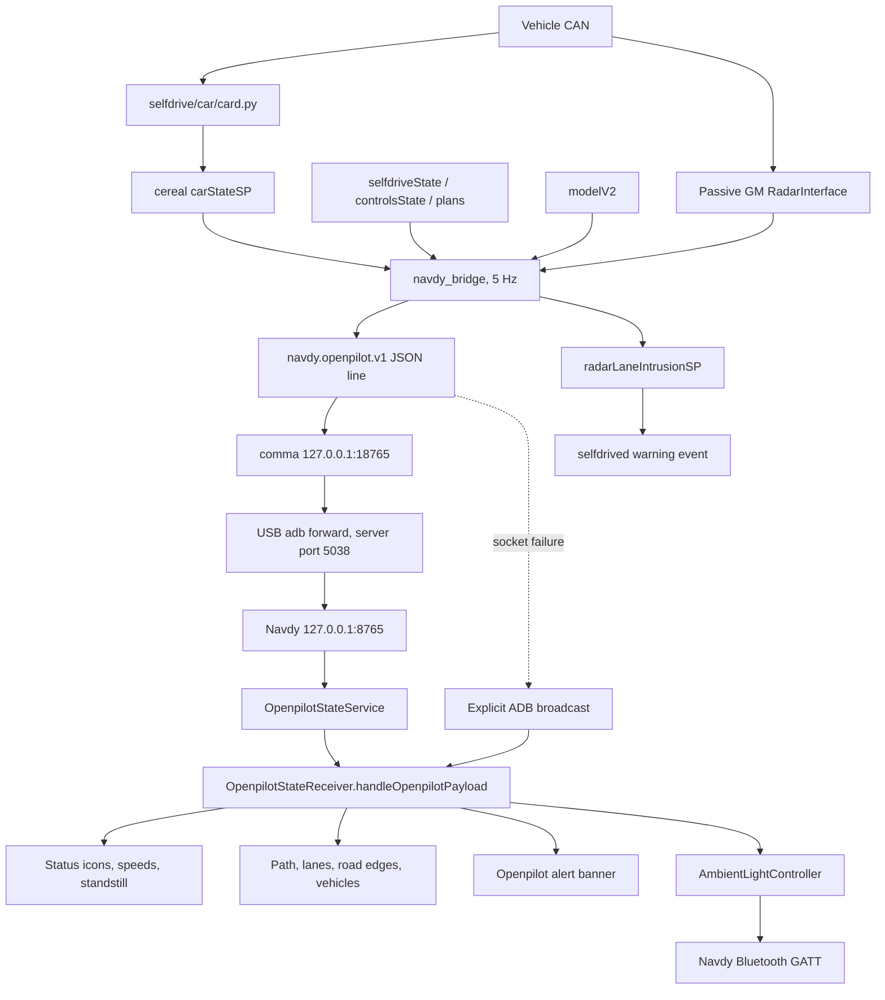

# Comma to Navdy Integration

이 문서는 현재 Wayon Sunnypilot에서 comma 장치와 Navdy HUD를 연결하는 전체 구현을 설명한다.
다른 개발자나 AI가 기존 대화 기록 없이도 연결 구조를 이해하고, 수정하고, 빌드하고,
장치에서 진단할 수 있게 하는 것이 목적이다.

## 문서 기준

- 확인 날짜: 2026-07-16
- 기준 브랜치: `Sunnypilot`
- 기준 커밋: `1802d213`
- comma 저장소: `/data/openpilot` 또는 이 저장소의 checkout
- Mac 저장소: `/Users/ijonghyeog/Documents/sunnypilot`
- Navdy Android 작업 디렉터리: `/Users/ijonghyeog/Documents/navdy`
- Android 패키지: `com.navdy.hud.app`
- JSON 스키마: `navdy.openpilot.v1`

코드가 변경되면 이 문서의 상수, 타이밍, payload 필드, APK 버전도 함께 갱신해야 한다.

## 범위

이 문서가 다루는 범위:

- comma가 차량 상태를 읽어 Navdy용 JSON으로 만드는 과정
- comma와 Navdy 사이의 USB ADB 연결
- TCP socket 전송과 ADB broadcast fallback
- Navdy Android Service, Receiver, HUD overlay
- 인게이지/디스인게이지 UI 전환
- path, 차선, 도로 경계, 전방 및 측방 차량 표시
- raw GM radar와 `modelV2` 카메라 결과 융합
- 레이더 기반 차선 침범 경고
- Navdy 화면 전원 관리
- Navdy 내부 Bluetooth 앰비언트 제어
- Android APK 재구축 및 배포
- 테스트와 장애 진단

이 연결에 직접 포함되지 않는 것:

- Wayon Cloud, Firebase, My Traverse 업로드
- comma.ai backend 등록
- Cloudflare SSH 터널
- CommANav의 카메라 DB 취득 자체
- Navdy OBD 외기온도 취득 자체
- 음악 metadata 취득 자체

Cloudflare SSH로 원격 comma에 접속하더라도 Navdy 데이터 경로는 변하지 않는다. 원격에서는
comma에 접속한 뒤 comma 내부의 `adb -P 5038`을 사용한다.

## 한 줄 요약

comma가 `cereal`과 raw CAN을 5 Hz로 읽어 JSON을 만들고, comma의
`127.0.0.1:18765`에서 USB ADB forward를 거쳐 Navdy의
`127.0.0.1:8765`로 전송한다. Navdy Service는 JSON 한 줄을 읽어
`OpenpilotStateReceiver.handleOpenpilotPayload()`에 넘기며, socket이 실패하면 같은 JSON을
명시적 Android broadcast로 보낸다.

## 전체 아키텍처



## 포트와 Android component

| 항목 | 값 | 의미 |
| --- | --- | --- |
| comma ADB server | `5038` | 기본 ADB `5037`과 분리된 전용 server |
| comma socket | `127.0.0.1:18765` | bridge가 연결하는 host-side endpoint |
| Navdy socket | `127.0.0.1:8765` | Android Service가 listen하는 device-side endpoint |
| ADB forward | `tcp:18765 -> tcp:8765` | USB를 통한 TCP 터널 |
| Android package | `com.navdy.hud.app` | Navdy HUD 앱 |
| Android Service | `com.navdy.hud.app/.openpilot.OpenpilotStateService` | socket server |
| Android Receiver | `com.navdy.hud.app/.openpilot.OpenpilotStateReceiver` | broadcast와 공통 payload 처리 |
| Broadcast action | `com.navdy.OPENPILOT_STATE` | fallback action |
| String extra | `payload` | JSON 문자열 extra |

중요한 구분:

- `5038`은 TCP payload 포트가 아니다. comma에서 실행되는 ADB server의 control 포트다.
- `18765`는 comma loopback 포트다.
- `8765`는 Navdy loopback 포트다.
- Navdy의 LAN IP를 알 필요가 없다.
- socket server가 loopback에만 bind되므로 LAN에서 `8765`로 직접 연결할 수 없다.

## 소스 파일 지도

| 파일 | 책임 |
| --- | --- |
| [`system/manager/process_config.py`](../../system/manager/process_config.py#L128) | `navdy_bridge`를 항상 실행하고 crash 시 재시작 |
| [`selfdrive/navdy/navdy_power_bridge.py`](navdy_power_bridge.py#L13) | manager용 기본 인자와 CPU affinity |
| [`selfdrive/navdy/navdy_op_bridge.py`](navdy_op_bridge.py#L24) | payload 생성, geometry, radar, socket, ADB, power |
| [`selfdrive/car/card.py`](../car/card.py#L264) | 표준 `CarState`를 `carStateSP`의 Navdy mirror 필드에 기록 |
| [`cereal/custom.capnp`](../../cereal/custom.capnp#L438) | `CarStateSP`, `RadarLaneIntrusionSP` schema |
| [`cereal/log.capnp`](../../cereal/log.capnp) | cereal union에 custom message 등록 |
| [`cereal/services.py`](../../cereal/services.py) | `carStateSP` service 주기 등록 |
| [`sunnypilot/.../radar_lane_intrusion.py`](../../sunnypilot/selfdrive/controls/lib/radar_lane_intrusion.py) | 차선 접근 위험도와 실제 침범 감지 |
| [`selfdrive/selfdrived/selfdrived.py`](../selfdrived/selfdrived.py#L220) | 침범 message를 warning event로 변환 |
| [`sunnypilot/selfdrive/selfdrived/events.py`](../../sunnypilot/selfdrive/selfdrived/events.py#L255) | 차선 침범 경고 문구와 소리 |
| [`selfdrive/navdy/test_navdy_op_bridge.py`](test_navdy_op_bridge.py) | bridge, payload, Android patch 정적 계약 테스트 |
| [`hud_patch/.../OpenpilotPathView.java`](hud_patch/engaged-path-v7-alert-banner-speed-warning/src/com/navdy/hud/app/openpilot/OpenpilotPathView.java) | path와 차량 renderer의 읽기 쉬운 Java 기준본 |
| [`hud_patch/.../OpenpilotAlertBannerView.java`](hud_patch/engaged-path-v7-alert-banner-speed-warning/src/com/navdy/hud/app/openpilot/OpenpilotAlertBannerView.java) | alert banner Java 기준본 |
| [`hud_patch/.../OpenpilotStateReceiver.smali`](hud_patch/engaged-path-v7-alert-banner-speed-warning/smali/com/navdy/hud/app/openpilot/OpenpilotStateReceiver.smali) | 현재 APK에 넣는 실제 receiver 구현 |
| [`hud_patch/.../screen_home_smartdash.xml`](hud_patch/engaged-path-v7-alert-banner-speed-warning/res/layout/screen_home_smartdash.xml) | 640 x 240 dashboard layout |

저장소 밖의 Android 기준 파일:

```text
/Users/ijonghyeog/Documents/navdy/
  hud_ui_work/20260626-200901/
    java_src/com/navdy/hud/app/openpilot/OpenpilotStateService.java
    java_src/com/navdy/hud/app/openpilot/OpenpilotStateReceiver.java
    java_src/com/navdy/hud/app/ambient/AmbientLightController.java
    decompiled/apktool/AndroidManifest.xml
    decompiled/apktool/smali_classes2/com/navdy/hud/app/openpilot/
  build_keys/navdy-test.jks
  build_outputs/
```

`java_src`는 이해와 수정 설계를 위한 복원본이다. APK에 실제로 적용되는 최종 진실은
빌드에 넣은 smali와 resource다. Java만 수정하고 smali 또는 dex를 갱신하지 않으면 장치 동작은
바뀌지 않는다.

## 물리 연결과 신뢰 경계

물리 방향은 다음과 같다.

```text
comma: USB/ADB host  <---- USB data cable ---->  Navdy: Android ADB device
```

필수 조건:

1. USB 케이블이 충전 전용이 아니라 data 통신을 지원해야 한다.
2. Navdy에서 ADB daemon이 실행 중이어야 한다.
3. comma의 ADB key가 Navdy에 승인되어야 한다.
4. comma의 전용 ADB server `5038`에서 Navdy가 `device` 상태여야 한다.
5. Navdy APK에 socket Service와 Receiver가 모두 등록되어 있어야 한다.

보안 특성:

- JSON 자체에는 암호화, 서명, 인증 token이 없다.
- 보안 경계는 USB 물리 연결과 ADB authorization이다.
- socket은 Navdy loopback에만 bind한다.
- Receiver는 현재 `exported=true`라 Navdy 내부의 다른 앱도 action을 보낼 수 있다.
- 더 강한 격리가 필요하면 signature permission을 Manifest와 sender에 추가해야 한다.
- 이 변경을 할 경우 socket Service 시작 권한과 broadcast fallback도 함께 검증해야 한다.

## manager 시작 과정

[`process_config.py`](../../system/manager/process_config.py#L128):

```python
PythonProcess(
  "navdy_bridge",
  "selfdrive.navdy.navdy_power_bridge",
  always_run,
  restart_if_crash=True,
)
```

따라서 bridge는 다음 상태에서도 실행된다.

- Onroad
- Offroad
- 차량 CAN이 없는 상태
- Navdy USB가 잠시 끊긴 상태

Manager가 child process를 시작하면 [`navdy_power_bridge.py`](navdy_power_bridge.py#L13)가 다음 기본
인자를 사용한다.

```text
--hz 5
--path-update-sec 0.1
--radar-overlay
--adb-path adb
--adb-server-port 5038
--no-stdout
--manage-navdy-power
--socket-transport
--heartbeat-sec 1
--power-on-ensure-sec 60
--power-off-delay-sec 30
```

추가 동작:

- CPU affinity를 `[0, 1, 2, 3]`으로 설정한다.
- manager가 넘긴 관계없는 argv를 기본 인자로 교체한다.
- 실제 bridge는 `/usr/local/venv/bin/python3`가 있으면 해당 Python으로 재실행한다.
- `--no-stdout` 때문에 정상 payload는 manager log에 계속 출력되지 않는다.
- crash가 발생하면 manager가 자동 재시작한다.

## comma 데이터 생산

### `carStateSP` mirror

표준 차량 상태는 [`card.py`](../car/card.py#L264)에서 `carStateSP`로 mirror된다.

| `CarStateSP` 필드 | 원본 | 단위/형식 |
| --- | --- | --- |
| `navdyVCruise` | `CS.vCruise` | km/h |
| `navdyVCruiseCluster` | `CS.vCruiseCluster` | km/h |
| `navdyVEgo` | `CS.vEgo` | m/s |
| `navdyVEgoCluster` | `CS.vEgoCluster` | m/s |
| `navdyCruiseSpeed` | `CS.cruiseState.speed` | m/s |
| `navdyCruiseSpeedCluster` | `CS.cruiseState.speedCluster` | m/s |
| `navdyStandstill` | `CS.standstill` | bool |
| `navdyCruiseStandstill` | `CS.cruiseState.standstill` | bool |
| `navdyGearShifter` | `CS.gearShifter` | lowercase text |
| `navdyLeftBlinker` | `CS.leftBlinker` | bool |
| `navdyRightBlinker` | `CS.rightBlinker` | bool |
| `navdyLeftBlindspot` | `CS.leftBlindspot` | bool |
| `navdyRightBlindspot` | `CS.rightBlindspot` | bool |

`cs_sp_send.valid`는 `CS.canValid`를 따른다. Service 등록 주기는 100 Hz지만 bridge는 5 Hz로만
읽는다. 별도 mirror를 쓰는 이유는 Navdy가 필요한 차량 필드를 하나의 custom message에서 안정적으로
가져오고, 표준 service 구독 변경에 영향을 덜 받게 하기 위해서다.

### bridge가 구독하는 service

빠른 상태 service:

```text
selfdriveState
carStateSP
controlsState
starpilotPlan            # 현재 cereal에 있을 때만
longitudinalPlan
longitudinalPlanSP
```

별도 model service:

```text
modelV2
```

전원 관리 활성 시 추가 service:

```text
deviceState
pandaStates
```

존재하지 않는 optional service는 `messaging.SERVICE_LIST`를 검사한 뒤 제외한다. 예를 들어
일부 버전에 `starpilotPlan`이 없어도 bridge 전체가 죽지 않는다.

### freshness 규칙

- `service_recent()` 기본 유효 시간은 1초다.
- Onroad로 판단된 상태에서는 최근 `selfdriveState`가 없으면 payload를 만들지 않는다.
- 최근 `carStateSP`가 없으면 `default_car_state()`를 사용한다.
- 기본 차량 상태는 속도 0, unknown gear, 아이콘 false다.
- 이 fallback은 stale 차량 값을 계속 표시하는 것보다 빈 값을 표시하도록 설계됐다.

따라서 다음 증상은 transport 문제와 구분해야 한다.

- HUD 전체가 갱신되지 않음: `selfdriveState` 또는 transport 확인
- OP 상태는 갱신되나 속도/기어/깜빡이만 비어 있음: `carStateSP` freshness 확인
- 상태와 속도는 정상이나 path만 없음: `active`, `modelV2`, geometry 확인

## 상태와 속도 변환

### `active`, `enabled`, `engaged`

payload는 세 값을 모두 포함한다.

- `enabled`: selfdrive 상태 machine이 enabled 계열인지 표시
- `active`: 실제 openpilot 제어가 active인지 표시
- `engaged`: Navdy 호환 alias이며 현재 `active`와 같다
- `disengaged`: 현재 `not enabled`

**Navdy engaged UI 전환 기준은 반드시 `active`다.**

`enabled`를 UI 전환 기준으로 쓰면 `preEnabled`, 정차 대기, soft disabling 구간에서 engaged 배치가
너무 일찍 나타난다. 과거 디스인게이지 상태인데 아이콘 위치가 engaged처럼 바뀐 문제가 이 구분과
관련됐다.

### 현재 속도

우선순위:

1. `carState.vEgoCluster`가 양수면 cluster 속도
2. 아니면 `carState.vEgo`
3. m/s에 `3.6`을 곱해 `vEgoKph` 생성

### ACC 설정 속도

[`set_speed_kph()`](navdy_op_bridge.py#L289)의 우선순위:

1. `carState.vCruiseCluster`
2. `carState.vCruise`
3. `controlsState.vCruiseClusterDEPRECATED`
4. `controlsState.vCruiseDEPRECATED`
5. `carState.cruiseState.speedCluster * 3.6`
6. `carState.cruiseState.speed * 3.6`
7. `starpilotPlan.vCruise`
8. `longitudinalPlan.vCruiseDEPRECATED`

인게이지 중 일시적으로 0이 들어오면 마지막 양수 설정 속도를 유지한다. 이 유지 로직은 display
안정화용이며 차량 제어 값에는 영향을 주지 않는다.

ICBM 자동 제어 중에는 세 속도를 구분해 관리한다.

- `setSpeedKph`: 운전자가 지정한 복귀 목표 속도. 기존 ACC SET 위치를 유지한다.
- `actualAccSetKph`: 버튼 스니핑으로 바뀐 순정 ACC의 현재 실제 설정 속도.
- `automaticAccTargetKph`: comma가 버튼 입력으로 맞추려는 제어 목표 속도. 유효한 TMAP 카메라
  제한속도 또는 활성화된 Vision 커브 목표 중 더 낮은 값을 사용한다.
- `automaticAccActive`: 임시 감속 또는 복귀 제어가 동작 중인지 나타낸다.
- `automaticControlSource`: 현재 제한을 만든 출처. `camera`, `curve`, `restore`, `inactive` 중
  하나를 사용한다.

HUD에서는 복귀 목표를 기존 초록색 ACC SET 아이콘과 함께 현재 속도 아래 중앙에 유지한다. 자동
제어의 출처가 카메라이면 오른쪽에 카메라 아이콘과 `감속 중`을 표시하며 아이콘을 부드럽게
페이드 인/아웃한다. Vision 커브 제한이면 커브 아이콘과 `automaticAccTargetKph`를 표시한다.
복귀 제어 중이거나 `automaticAccActive`가 꺼지면 보조 표시를 모두 숨긴다. 기존 실제 ACC 숫자,
방향 화살표, 완료 바 UI는 사용하지 않는다.

### TMAP 카메라 제한속도 반환

카메라 정보에 Wi-Fi는 사용하지 않는다. CommANav가 TMAP SDI를 Navdy로 보내는 기존 Bluetooth
알림에서 제한속도를 읽고, `OpenpilotStateService`가 comma와 이미 연결된 USB 데이터 포트 소켓의
응답으로 `cameraSpeedKph`와 `cameraSource=trafficNotification`을 돌려준다. 알림 발신자 이름에
`comma` 또는 `carrot`이 있다는 이유만으로 카메라로 분류하지 않으며, 제목·부제·본문에 카메라
키워드가 있는 실제 교통 알림만 허용한다. `navdy_op_bridge`와 ICBM은 출처 표식이 없는 숫자를
거부한다. 유효한 값은 `/dev/shm/navdy_camera_state.json`에 원자적으로 갱신된다. manager 실행은
정속 주행 중에도 1초 heartbeat로 Navdy 응답을 회수하며, ICBM은 2.5초 동안 응답이 없으면 제한속도를
즉시 무효화한다.

```text
TMAP -> CommANav -> Bluetooth -> Navdy HUD -> USB data port -> navdy_op_bridge -> ICBM
```

ICBM은 해당 제한속도와 활성화된 Vision 커브 목표 중 더 낮은 값을 순정 ACC의 임시 목표로 사용한다.
일반 longitudinal planner 목표, 전방차량 감속, 현재속도 기반 이동 목표는 사용하지 않는다. 운전자의
ACC SET 값은 별도로 보존하며 카메라 또는 커브 제한이 끝나면 해당 값으로 복귀한다. 물리 버튼,
가속 페달 override, cancel, resume, 디스인게이지가 감지되면 자동 프로필을 즉시 해제한다.

### 기어

기본값은 `carStateSP.navdyGearShifter`다. Reverse 진입으로 차량 process가 빠르게 Offroad가 되면서
기어 sample이 끊기는 경우를 보완하기 위해 `selfdriveState.alertType`이 `reverseGear` 또는
`silentReverseGear`이면 강제로 `reverse`를 전송한다.

### standstill과 오토홀드 아이콘

차량 정차 자체와 아이콘 표시 조건은 다르다.

```python
vehicle_standstill = carState.standstill or carState.cruiseState.standstill
show_stop_icon = (
  state == "preEnabled" or
  ((enabled or active) and vehicle_standstill)
)
```

결과:

| 상태 | 차량 정차 | 아이콘 |
| --- | --- | --- |
| 완전 disengaged | true | 숨김 |
| `preEnabled` | true/false | 표시 |
| engaged/active | true | 표시 |
| engaged/active | false | 숨김 |

단순히 `vEgo == 0`으로 아이콘을 켜면 주차 중에도 오토홀드 아이콘이 나타나므로 금지한다.

## JSON payload 계약

### 기본 필드

| 필드 | 형식 | 단위 | 설명 |
| --- | --- | --- | --- |
| `schema` | string | - | 항상 `navdy.openpilot.v1` |
| `seq` | integer | - | bridge loop sequence |
| `ts` | number | epoch seconds | payload 생성 시각 |
| `state` | string | - | `selfdriveState.state` enum 이름 |
| `enabled` | boolean | - | selfdrive enabled |
| `active` | boolean | - | 실제 active, UI 전환 기준 |
| `engaged` | boolean | - | `active` alias |
| `disengaged` | boolean | - | `not enabled` |
| `engageable` | boolean | - | selfdrive engage 가능 여부 |
| `opAvailable` | boolean | - | Navdy OP 준비 아이콘용 |
| `standstill` | boolean | - | 오토홀드 아이콘 표시 조건 |
| `cruiseStandstill` | boolean | - | `standstill` 호환 alias |
| `setSpeedKph` | number | km/h | ACC 설정 속도 |
| `vEgoKph` | number | km/h | 현재 cluster 우선 속도 |
| `gear` | string | - | `park`, `reverse`, `neutral`, `drive` 등 |
| `leftBlinker` | boolean | - | 좌측 방향지시등 |
| `rightBlinker` | boolean | - | 우측 방향지시등 |
| `blinkers` | string | - | `off`, `left`, `right`, `hazard` |
| `leftBlindspot` | boolean | - | 좌측 BSM |
| `rightBlindspot` | boolean | - | 우측 BSM |
| `blindspot` | string | - | `off`, `left`, `right`, `both` |
| `alertText1` | string | - | 이벤트 제목 |
| `alertText2` | string | - | 이벤트 설명 |
| `alertType` | string | - | event type과 category |
| `alertStatus` | string | - | `normal`, `userPrompt`, `critical` |
| `alertSize` | string | - | `none`, `small`, `mid`, `full` 등 |
| `greenLightAlert` | boolean | - | 초록불 감지 flag |
| `leadDepartAlert` | boolean | - | 전방 차량 출발 flag |

### geometry 필드

geometry는 `active=true`일 때만 생성한다.

| 필드 | 형식 | 설명 |
| --- | --- | --- |
| `navPathLeft` | number[] | path 좌측 경계의 `[x0,y0,x1,y1,...]` |
| `navPathRight` | number[] | path 우측 경계 |
| `navLaneFarLeft` | number[] | 좌측 인접 차선 바깥 선 |
| `navLaneLeft` | number[] | ego lane 좌측 선 |
| `navLaneRight` | number[] | ego lane 우측 선 |
| `navLaneFarRight` | number[] | 우측 인접 차선 바깥 선 |
| `navLane*Prob` | number | 해당 `modelV2.laneLineProbs` |
| `navLane*Type` | string | `unknown`, `dashed`, `solid`, `centerDashed`, `centerSolid` |
| `navRoadEdgeLeft` | number[] | confidence를 통과한 좌측 도로 경계 |
| `navRoadEdgeRight` | number[] | confidence를 통과한 우측 도로 경계 |
| `navRoadEdge*Prob` | number | `1 - roadEdgeStd` |
| `navLaneRiskLeft` | number | 0.0부터 1.0까지 좌측 접근 위험도 |
| `navLaneRiskRight` | number | 0.0부터 1.0까지 우측 접근 위험도 |
| `navVehicles` | object[] | 레이더/카메라/fused 차량 목록 |

### `navVehicles` 항목

| 필드 | 형식 | 단위 | 설명 |
| --- | --- | --- | --- |
| `trackId` | integer | - | radar track ID, vision은 `-100`, `-101` |
| `screenX` | number | logical px | 4부터 316 사이로 clamp |
| `screenY` | number | logical px | 가까울수록 아래쪽 |
| `yawDeg` | number | degrees | vehicle sprite 회전, -24부터 24 |
| `distanceM` | number | m | 차량 전방 거리 |
| `relativeSpeedMps` | number | m/s | 상대 속도 |
| `lateralM` | number | m | model 좌표계 보정 후 횡 위치 |
| `rawRadarLateralM` | number | m | radar 횡 위치를 model 축으로 변환한 원본 |
| `widthM` | number | m | radar track width, 최대 4 m |
| `widthCenterApplied` | boolean | - | 좌측 radar width 중심 보정 적용 여부 |
| `lane` | string | - | `left`, `center`, `right` |
| `source` | string | - | `radar`, `vision`, `fused` |
| `longitudinalLead` | boolean | - | 현재 MPC source가 선택한 `lead0` 또는 `lead1`인지 여부 |
| `confidence` | number | - | 표시 우선순위용 신뢰도 |

### payload 예시

```json
{
  "schema": "navdy.openpilot.v1",
  "seq": 412,
  "ts": 1784191200.125,
  "state": "enabled",
  "enabled": true,
  "active": true,
  "engaged": true,
  "disengaged": false,
  "engageable": true,
  "opAvailable": true,
  "standstill": false,
  "cruiseStandstill": false,
  "setSpeedKph": 100.0,
  "vEgoKph": 82.4,
  "gear": "drive",
  "leftBlinker": false,
  "rightBlinker": false,
  "blinkers": "off",
  "leftBlindspot": false,
  "rightBlindspot": true,
  "blindspot": "right",
  "alertText1": "",
  "alertText2": "",
  "alertType": "",
  "alertStatus": "normal",
  "alertSize": "none",
  "greenLightAlert": false,
  "leadDepartAlert": false,
  "navPathLeft": [116.0, 96.0, 135.2, 69.5, 148.6, 43.2, 155.0, 8.0],
  "navPathRight": [204.0, 96.0, 184.8, 69.5, 171.4, 43.2, 165.0, 8.0],
  "navLaneLeft": [82.0, 96.0, 120.0, 50.0, 151.0, 8.0],
  "navLaneRight": [238.0, 96.0, 200.0, 50.0, 169.0, 8.0],
  "navLaneRiskLeft": 0.0,
  "navLaneRiskRight": 0.62,
  "navVehicles": [
    {
      "trackId": 14,
      "screenX": 176.3,
      "screenY": 43.5,
      "yawDeg": 8.0,
      "distanceM": 31.4,
      "relativeSpeedMps": -1.2,
      "lateralM": 1.1,
      "rawRadarLateralM": 1.2,
      "widthM": 1.8,
      "widthCenterApplied": false,
      "lane": "right",
      "source": "fused",
      "longitudinalLead": false,
      "confidence": 0.91
    }
  ]
}
```

예시 좌표는 구조 설명용이며 실제 route 값이 아니다.

## 이벤트 처리

### 일반 openpilot 이벤트

`selfdriveState`에서 다음 값을 그대로 읽는다.

```text
alertText1
alertText2
alertType
alertStatus
alertSize
```

Navdy banner는 `alertStatus`에 따라 배경을 선택한다.

| 상태 | 배경 |
| --- | --- |
| `normal` | alpha 160 검정 |
| `userPrompt` | alpha 170 주황 |
| `critical` | alpha 180 빨강 |

Banner 높이는 100 px이고 640 px 전체 폭을 사용한다. 표시 animation은 240 ms, 숨김은
180 ms다. 동일한 type/status/text 조합이 반복되면 animation을 재시작하지 않는다.

### `resumeRequired` 억제

오토홀드 standstill 중 `Resume 버튼을 누르세요`를 Navdy에 표시하지 않기 위해 bridge의
`payload_from_messages()`에서 `alertType`의 첫 부분이 `resumeRequired`인지 검사한다.

해당 경우 Navdy로 보내는 alert 필드만 다음처럼 비운다.

```text
alertText1 = ""
alertText2 = ""
alertType = ""
alertStatus = "normal"
alertSize = "none"
```

Android banner도 `resumeRequired` type 또는 `Resume 버튼`으로 시작하는 제목을 한 번 더
차단한다. 이중 차단은 stale APK나 오래된 sender와의 호환을 위한 방어다.

**금지:** `resumeRequired`를 openpilot event 정의나 `selfdrived`에서 제거하면 안 된다.
그 이벤트는 comma 자체 오토홀드 timer와 저속 조향 상태 표현에도 관여한다. Navdy 표시만
serialization/renderer 경계에서 숨겨야 한다.

### 초록불과 전방 차량 출발

`longitudinalPlanSP.e2eAlerts`에서 다음 flag를 읽는다.

- `greenLightAlert`
- `leadDepartAlert`

flag를 감지하면 3초 동안 보존한다. 이미 다른 openpilot alert가 화면을 차지하지 않을 때만 다음
한국어 banner로 만든다.

| flag | 제목 | 설명 |
| --- | --- | --- |
| `greenLightAlert` | `신호 변경됨` | `전방 신호 변경 감지됨` |
| `leadDepartAlert` | `전방 차량 출발` | `전방 차량이 출발했습니다` |

기존 critical/userPrompt alert가 있으면 덮어쓰지 않는다.

## 표시 안정화

[`stabilize_display_payload()`](navdy_op_bridge.py#L199)이 빠른 CAN 또는 planner sample의 순간
누락을 완화한다.

- 마지막 양수 `setSpeedKph`를 engaged/enabled 동안 보존
- 좌우 blinker true를 마지막 true 이후 1.6초 보존
- 좌우 BSM true를 마지막 true 이후 1.6초 보존
- aggregate `blinkers`, `blindspot` 문자열 재계산
- E2E alert를 3초 보존

이 값은 Navdy 표시 전용이다. CAN, `CarControl`, `sendcan`, actuator command에는 쓰이지 않는다.

## Path 좌표와 투영

### 좌표계

현재 코드의 축 규칙:

- `modelV2.x`: 차량 전방, meter
- `modelV2.y`: 차량 오른쪽이 양수
- GM radar `yRel`: 차량 왼쪽이 양수
- HUD logical canvas: 폭 320, 높이 100
- HUD 중심: `screenX = 160`
- 가까운 geometry: `screenY` 약 96
- 80 m geometry: `screenY` 약 8

Radar를 model 좌표계로 옮길 때 `modelY = -radarY`를 사용한다. 이 부호를 renderer에서 다시
뒤집으면 좌우가 반전된다. 좌우 수정은 bridge와 Android 중 한 곳에서만 해야 한다.

### 투영 공식

[`navdy_project_point()`](navdy_op_bridge.py#L334):

```text
d = clamp(x / 80, 0, 1) ^ 0.65
lateral_scale = 44 * (1 - d) + 8 * d
screenX = 160 + y * lateral_scale
screenY = 96 - 88 * d
```

`x`가 0에서 80 m 범위를 벗어나면 표시하지 않는다. `screenX`는 차량 marker 출력 시
4에서 316으로 clamp한다.

실제 dashboard는 640 x 240이지만 path overlay는 다음 위치의 320 x 100 logical view다.

```text
left = 160
top = 120
width = 320
height = 100
```

따라서 bridge 좌표에 임의로 2배 scaling을 추가하면 안 된다. Android layout이 해당 logical
좌표를 640 x 240 HUD 안에 배치한다.

### Path와 차선

- `modelV2.position`을 path 중심으로 사용한다.
- path 좌우 경계는 `position.y - 1.0 m`, `position.y + 1.0 m`다.
- `laneLines[0..3]`을 모두 전달한다.
- 선 하나당 최대 10점을 균등 index sampling한다.
- JSON은 `[x0, y0, x1, y1, ...]` 평면 배열이다.
- 최소 두 점, 즉 배열 길이 4 이상이어야 유효하다.

Android renderer:

- path 영역은 반투명 녹색 fill과 녹색 좌우 edge
- `unknown`, `dashed`, `centerDashed` lane line은 점선
- `solid`, `centerSolid` lane line은 실선
- `centerDashed`, `centerSolid`는 노란 중앙선으로 표시
- 도로 끝 경계는 빨간 실선으로 표시
- 점선 pattern은 `56 px line + 24 px gap`
- 점선 이동 속도는 `clamp(vEgoKph * 0.8, 18, 80) px/s`
- 주행 중 약 66 ms마다 dash phase를 갱신
- 정지 시 animation 정지
- lane alpha는 probability에 따라 조절
- 차선 stroke는 `3.2 px`, 도로 경계 stroke는 `2.8 px`
- 원거리 선 alpha는 `0x55`, 근거리 선 alpha는 `0xff`까지 증가

### 차선 표식 분류

`lane_marking_classifier.py`는 `modelV2.laneLines`의 기존 좌표를 카메라 영상에 투영한 뒤 각 선
주변의 가느다란 ROI만 읽는다. 전체 프레임 변환, 별도 신경망, 새 segmentation은 실행하지 않는다.

- VisionIPC의 기존 NV12 road frame을 zero-copy view로 읽음
- 0.5초 간격, 최대 2 Hz
- `modelV2.frameId`와 road frame ID 차이가 0에서 2인 영상만 사용
- 7에서 42 m 구간만 0.75 m 간격으로 검사
- ROI별 배경 밝기에 적응하는 국소 대비와 선 위치 연속성으로 실선과 점선 분류
- 어두운 노란 도색은 주변 조명의 색온도를 뺀 상대 NV12 UV chroma로 분류
- 넓은 거리 구간에서 이어지는 노란색만 통과시켜 짧은 횡단 표식은 제외
- 노란색은 확인됐지만 형태가 불명확하면 노란 실선으로 유지
- 단일 프레임 오검출로 형태나 중앙선 여부가 바뀌지 않도록 EMA와 진입·이탈 hysteresis 적용
- 결과는 시간 필터를 통과한 뒤 `navLane*Type` 네 문자열로만 전송
- 결과가 2초 이상 오래되거나 confidence가 낮으면 `unknown`
- 색상과 형태가 모두 `unknown`이면 기존 점선 표시로 fallback

분류는 `navdy_bridge` 내부의 latest-only daemon thread에서 실행된다. 새 요청은 이전 대기 요청을
덮어쓰며, 결과는 Navdy JSON에만 추가된다. `modeld`, `controlsd`, planner, panda safety 및
조향·가감속 값에는 연결하지 않는다.

### 도로 경계

도로 경계 confidence:

```text
confidence = clamp(1 - roadEdgeStd, 0, 1)
```

- confidence가 0.5 미만이면 JSON에 넣지 않는다.
- Android에서도 0.5 미만을 그리지 않는다.
- 도로 경계는 점선이 아니라 실선이다.
- 도로 경계 alpha는 `confidence * 210 + 25`로 계산한다.
- 도로 경계가 없거나 불확실하면 빈 선을 억지로 생성하지 않는다.

### 빠른 상태 payload와 geometry 유지

Android `OpenpilotPathView.updatePayload()`는 active 상태에서 `navPathLeft`가 없는 payload를
받으면 기존 geometry를 지우지 않는다. 대신 속도, 차량, lane risk처럼 payload에 실제로 포함된
항목만 갱신한다.

geometry를 지우는 조건:

- `active=false`
- payload가 null
- 새 path가 들어왔지만 필수 선이 malformed
- JSON parse 실패

이 동작 덕분에 아이콘이나 이벤트를 빠르게 보낼 때 매번 큰 path 배열을 동봉하지 않아도 화면이
깜빡이지 않는다.

## 레이더 입력

### 읽기 방식

[`NavdyRadarReader`](navdy_op_bridge.py#L740)는 background thread에서 `can` socket을 읽는다.

1. 저장된 `CarParams` 또는 `CarParamsPersistent`를 읽는다.
2. fingerprint가 GM DBC에 있는지 확인한다.
3. 복사한 `CarParams`에 `radarUnavailable=False`를 설정한다.
4. GM `RadarInterface`를 별도로 생성한다.
5. raw `can` capnp를 `can_capnp_to_list()`로 변환한다.
6. `RadarInterface.update()`에 넣는다.
7. track ID, 거리, 횡 위치, 상대 속도, 폭을 snapshot으로 보관한다.

이 `RadarInterface`는 Navdy 표시용 별도 decoder다. 표준 controls radar pipeline을 교체하지 않는다.

### 활성 조건과 filtering

- openpilot `active=true`일 때만 radar sample을 처리
- inactive 전환 시 track 전부 삭제
- 최소 2 sample이 들어온 track만 공개
- 마지막 update 후 0.35초가 지나면 stale 처리
- 거리 jump 제한: `max(8 m, distance * 0.35)`
- smoothing alpha: 0.55
- radar `canError` 또는 `radarFault` 시 track 삭제
- 예외 message가 바뀔 때만 `cloudlog.exception()` 기록
- reader thread가 죽으면 5초 후 재생성 시도

표시용 최대값:

- 최대 거리: 80 m
- 최대 차량 수: 8대
- track width clamp: 0에서 4 m

Raw decoder는 더 먼 target을 볼 수 있어도 HUD payload는 80 m까지만 보낸다.

### 안전 경계

Navdy radar reader는 다음을 하지 않는다.

- `sendcan` publish
- `CarControl` 변경
- steering/acceleration command 변경
- 표준 `liveTracks` 덮어쓰기
- 표준 `radarState` 덮어쓰기
- panda safety 설정 변경

HUD를 고치기 위해 위 경계를 넘는 수정은 금지한다.

## 카메라와 레이더 차량 융합

### 카메라 candidate

`modelV2.leadsV3`의 앞 두 lead만 후보로 사용한다.

- `prob >= 0.5`
- 거리 2에서 80 m
- camera/radar longitudinal offset 1.52 m 보정
- `modelV2.velocity.x[0]`를 이용해 상대 속도 계산
- `yStd`를 lateral tolerance 계산에 사용

### 차선 분류

우선 lane line을 이용한다.

- ego lane: `laneLines[1]`과 `[2]` 사이, inner confidence 0.3 이상
- left lane: `[0]`과 `[1]` 사이, confidence 0.2 이상
- right lane: `[2]`와 `[3]` 사이, confidence 0.2 이상

차선이 없거나 confidence가 낮으면 `modelV2.position` path 중심과 추정 lane 폭을 사용한다.

- 기본 lane 폭: 3.6 m
- 허용 측정 폭: 2.4에서 4.8 m
- path 중심 ±0.5 lane 폭: center
- 다음 한 lane 폭: left 또는 right

이 fallback 때문에 차선 표시가 없는 골목에서도 차량 marker를 표시할 수 있다.

### 좌측 radar width 중심 보정

GM radar `yRel`은 object edge 성격이 나타나는 경우가 있어 좌측 차량이 차선 안쪽으로 밀려 보일 수
있다. 현재 구현은 width를 이용한 중심 후보를 계산한다.

```text
rawModelY = -radarY
centerModelY = -radarY - width / 2
```

`centerModelY`로 분류한 결과가 left lane일 때만 해당 보정을 적용한다. center와 right lane을 같은
방향으로 밀지 않기 위한 비대칭 보정이다. 향후 차선 침범 판정에 raw 값이 필요하므로 두 값을 모두
payload에 남긴다.

### 중복 제거

Camera lead마다 아직 사용하지 않은 radar target을 찾는다.

좌표 match 조건:

```text
distance tolerance = max(5 m, vision distance * 0.25)
lateral tolerance = max(1.5 m, vision yStd * 2)
```

좌표가 tolerance 안에 들거나 projected marker IoU가 0.25 이상이면 같은 차량 후보로 본다.

- match되면 radar 항목을 `source=fused`로 변경
- fused 횡 위치는 vision 위치 사용
- fused confidence는 최소 0.75
- match되지 않은 vision lead는 별도 `vision` 항목 유지
- vision끼리도 IoU 0.25 이상 겹치면 중복 억제
- `longitudinalPlanSource=lead0/lead1`이면 대응하는 `radarState.leadOne/leadTwo`를
  `trackId`로 우선 매칭하고, vision-only lead는 거리와 횡 위치로 매칭
- 실제 MPC source로 선택된 차량만 `longitudinalLead=true`이며 하늘색으로 표시
- 단순히 `source=fused`인 차량은 더 이상 하늘색 조건이 아님
- 최종 우선순위: longitudinal lead, fused, vision, radar
- 같은 우선순위에서는 가까운 차량 우선 선택
- 최대 8대 선택
- draw 순서는 먼 차량부터 가까운 차량 순서라 가까운 marker가 마지막에 그려짐

### 차량 yaw와 크기

기본 perspective yaw는 HUD 중심에서 멀어질수록 커진다.

| 중심에서 거리 | 기본 yaw |
| --- | --- |
| 24 px 미만 | 0도 |
| 48 px 미만 | 8도 |
| 72 px 미만 | 12도 |
| 104 px 미만 | 16도 |
| 그 이상 | 24도 |

Left lane은 음수, right lane은 양수다. 여기에 차량 거리 전후 4 m 구간의 lane/path tangent를
계산해 커브 곡률을 반영한다. 최종 yaw는 -24도에서 24도로 clamp한다.

차량 크기:

```text
nearScale = 1 - distance / 80
width = 12 + nearScale * 46.5
height = width * 1.55
```

Android는 0도 marker와 좌우 4, 8, 12, 16, 20, 24도 bitmap을 미리 load한다. runtime에서
3D 모델을 계산하지 않는다.

색상:

| source | 색상 |
| --- | --- |
| radar | 반투명 흰색 |
| vision | 초록색 |
| fused | 청록색 |

## 레이더 기반 차선 접근과 침범 경고

구현은 [`radar_lane_intrusion.py`](../../sunnypilot/selfdrive/controls/lib/radar_lane_intrusion.py)에
있다.

### 활성 조건

- ego 속도 최소 5 m/s
- target 거리 4에서 60 m
- ego lane 양쪽 probability 최소 0.45
- openpilot 자체 lane change가 진행 중이면 detector reset

### 좌표와 차량 폭

- GM radar 왼쪽 양수 `yRel`을 model 오른쪽 양수로 바꾸기 위해 부호 반전
- target 반폭은 0.9 m로 가정
- 차선 밖으로 최소 0.25 m 떨어진 상태를 먼저 3 sample 관찰
- 차선 안으로 최소 0.10 m 들어와야 실제 intrusion 후보
- 안쪽 이동 속도 최소 0.25 m/s
- intrusion 상태 3 sample 연속 필요

새로 나타난 차량이 이미 차선 안에 있는 경우는 intrusion으로 보지 않는다. 먼저 차선 밖에 있었다가
안쪽으로 움직였다는 history가 필요하다.

### track 안정성

- sample 최대 간격: 0.35초
- stale track: 0.50초
- lateral jump 최대: 1.25 m
- distance jump 최대: `max(6 m, distance * 0.30)`
- inward speed low-pass: 기존 0.55, 새 측정 0.45

### lane risk 색상

실제 intrusion event 전부터 차선에 가까워지는 정도를 `navLaneRiskLeft/Right` 0에서 1로 만든다.

- risk 시작 gap: 0.80 m
- 최소 inward speed: 0.20 m/s
- risk fade time: 0.45초
- left risk는 ego lane 왼쪽 선에만 적용
- right risk는 ego lane 오른쪽 선에만 적용
- far lane에는 risk 색상을 적용하지 않음
- Android에서 흰색에서 빨간색으로 10단계 blend

### warning event back-channel

Bridge는 매 geometry update마다 `radarLaneIntrusionSP`를 publish한다.

```text
detected
trackId
side
distance
lateral
inwardSpeed
leftRisk
rightRisk
```

`selfdrived`는 `detected=true`를 받으면 `radarLaneIntrusion` warning을 추가한다. Cooldown은 4초다.

현재 이벤트:

```text
제목: 전방 차량 주의
설명: 전방 차량 차선 침범함
상태: userPrompt / mid
소리: prompt
표시 시간: 2초
```

이 경로는 warning event만 만든다. 조향 또는 longitudinal 제어를 직접 바꾸지 않는다.

## 전송 주기와 부하 제어

| 항목 | 현재 값 |
| --- | --- |
| `carStateSP` publish | 100 Hz |
| bridge loop | 5 Hz |
| path 최소 설정 주기 | 0.1초 |
| 현재 실효 path 주기 | 최대 5 Hz |
| unchanged heartbeat | 5초 |
| socket timeout | 0.25초 |
| socket reconnect 제한 | 1초 |
| ADB command timeout | 4초 |
| ADB recovery 제한 | 5초 |
| ADB `wait-for-device` | 1초 |
| blinker hold | 1.6초 |
| BSM hold | 1.6초 |
| E2E alert hold | 3초 |
| radar stale | 0.35초 |
| radar reader 재생성 | 5초 |
| Android lane frame | 66 ms |
| Navdy turn blink | 450 ms |
| Ambient overspeed blink | 1초 |
| Ambient brightness sync | 5초 |

Bridge는 `ts`와 `seq`가 아니라 표시 내용으로 signature를 만든다. 다음 값이 바뀌었을 때만 즉시
전송한다.

- state와 active 상태
- 속도, 설정 속도, 기어
- standstill, blinker, BSM
- alert metadata
- path, lane, road edge와 probability
- lane risk
- 차량 위치, 거리, yaw, lane, source

변화가 없어도 heartbeat 5초가 지나면 한 번 다시 보낸다.

부하를 낮게 유지하는 핵심:

- 정상 상태에서는 `adb shell` process를 payload마다 만들지 않고 한 개 TCP socket 사용
- ADB broadcast는 socket 실패 때만 사용
- broadcast fallback은 background thread에서 실행
- fallback queue는 최신 payload 하나만 유지
- path 선 하나당 최대 10점
- 차량 최대 8대
- radar는 active일 때만 decode
- 차량 bitmap은 Android에서 미리 load
- 이미지나 video frame을 comma에서 Navdy로 보내지 않음

## Socket 전송

### 시작

Bridge startup:

1. `adb -P 5038 start-server`
2. 짧은 `wait-for-device`
3. ADB forward 생성
4. Android Service 시작
5. comma localhost socket 연결

실제 명령:

```bash
adb -P 5038 forward tcp:18765 tcp:8765
adb -P 5038 shell am startservice \
  -n com.navdy.hud.app/.openpilot.OpenpilotStateService
```

그 후 Python:

```python
socket.create_connection(("127.0.0.1", 18765), timeout=0.25)
```

### framing

각 payload는 compact JSON 한 줄이다.

```text
UTF-8 JSON bytes + 0x0A newline
```

길이 prefix나 binary header가 없다. Android는 `BufferedReader.readLine()`으로 읽는다. JSON 안의
문자열 newline은 serializer가 escape하므로 framing을 깨지 않는다.

### reconnect

`sendall()`이 실패하면:

1. 기존 socket close
2. ADB forward 재생성
3. Android Service 재시작 요청
4. socket 강제 reconnect
5. 같은 payload 한 번 재전송
6. 재실패하면 broadcast fallback

Navdy가 reboot되면 ADB forward가 사라질 수 있으므로 reconnect 때마다 forward를 다시 보장한다.

## ADB broadcast fallback

Socket이 실패하고 `--no-adb-fallback`이 지정되지 않았으면 다음 형식으로 전송한다.

```bash
adb -P 5038 shell \
  "am broadcast \
    -n com.navdy.hud.app/.openpilot.OpenpilotStateReceiver \
    -a com.navdy.OPENPILOT_STATE \
    --es payload '<compact JSON>'"
```

Bridge는 `shlex.quote()`를 사용해 JSON과 component/action을 shell-safe하게 만든다.

비동기 sender 특징:

- main 5 Hz loop에서 `adb shell` 완료를 기다리지 않음
- pending payload가 있으면 새 payload로 덮어씀
- backlog를 순차 재생하지 않음
- 오래된 blinker/BSM/event가 늦게 표시되는 현상을 방지

`--sync-adb` 또는 `--once`에서는 동기 전송할 수 있다. 정상 manager runtime에서는 비동기가
기본이다.

## Android Socket Service

현재 읽기 쉬운 기준본:

```text
/Users/ijonghyeog/Documents/navdy/hud_ui_work/20260626-200901/
  java_src/com/navdy/hud/app/openpilot/OpenpilotStateService.java
```

동작:

1. `Service.onStartCommand()`에서 server thread 시작
2. `START_STICKY` 반환
3. `127.0.0.1:8765`, backlog 1로 `ServerSocket` 생성
4. client accept마다 별도 client thread 생성
5. UTF-8 line을 읽음
6. Android main looper Handler에 dispatch
7. `OpenpilotStateReceiver.handleOpenpilotPayload(context, payload)` 호출
8. server 예외 발생 시 1초 후 다시 listen

Service는 static `sStarted`로 같은 process 안에서 중복 server thread를 막는다.

Manifest 필수 등록:

```xml
<service
    android:name="com.navdy.hud.app.openpilot.OpenpilotStateService"
    android:enabled="true"
    android:exported="true" />
```

Service class 또는 Manifest 등록이 빠지면 socket은 실패하고 broadcast fallback만 동작한다.
Fallback까지 빠지면 HUD 데이터가 전혀 갱신되지 않는다.

## Android Receiver와 HUD overlay

두 transport는 모두 같은 method로 합쳐진다.

```text
socket Service ----+
                   +--> OpenpilotStateReceiver.handleOpenpilotPayload()
ADB broadcast -----+
```

Receiver 처리 순서:

1. 같은 JSON을 `AmbientLightController.onOpenpilotPayload()`에 전달
2. JSON parse
3. `active`, `enabled`, `opAvailable`, standstill 계산
4. 설정 속도, 깜빡이, BSM, OP 상태 아이콘 갱신
5. engaged/disengaged layout 배치 갱신
6. `OpenpilotPathView.updatePayload(payload, active)` 호출
7. `OpenpilotAlertBannerView.updatePayload(payload)` 호출
8. current speed와 camera overspeed 색상 갱신

Overlay는 `TYPE_SYSTEM_ALERT` 계열 full-screen transparent WindowManager view다. 현재 title은
`NavdyOpenpilotStatus`다. Root는 화면 전체를 차지하지만 touch/focus를 방해하지 않도록 flags를
설정한다.

### disengaged UI

`active=false`일 때:

- 기존 Navdy dashboard 유지
- custom path 숨김 및 geometry clear
- engaged용 top/body mask 숨김
- RPM과 원래 dashboard 정보 유지
- OP 준비, set speed, blinker, BSM 아이콘을 disengaged 위치로 이동
- 현재 속도는 기존 dashboard 위치와 크기 유지
- 음악은 현재 속도 위에 `artist - title` 형식
- alert banner는 필요하면 stock HUD 위에 표시 가능

### engaged UI

`active=true`일 때:

- 상단 RPM 영역을 검정 mask로 가림
- 중앙 body 일부를 mask
- 320 x 100 path view 표시
- path, 차선, 도로 경계, 차량 표시
- current speed를 engaged 위치와 62 px 글꼴로 표시
- ACC set speed를 current speed 아래쪽에 표시
- 음악을 `artist - title` 형식으로 표시
- status icon 위치를 engaged 배치로 이동
- event banner를 HUD 위에 표시

UI 전환에서 icon visibility만 바꾸고 position을 그대로 두면 과거 문제처럼 disengaged에서도
engaged 위치가 남는다. 상태 전환 함수는 visibility와 layout margin을 함께 갱신해야 한다.

## Navdy가 자체 취득하는 값

다음 값은 comma JSON으로 보내지 않는다.

### 음악

- Navdy Android media/session 경로에서 취득
- 표시 형식: `artist - title`
- dashboard view 재생성 시 마지막 metadata 복원
- engaged와 disengaged TextView가 다르므로 둘 다 갱신해야 함

### 외기온도

- Navdy 자체 OBD 경로
- 표준 ambient air temperature PID `0x46`
- view bind 직후 한 번 읽음
- 이후 최대 5초에 한 번 읽음
- comma `carStateSP` 또는 Wayon Cloud 값이 아님

### 과속카메라 제한 속도

- Navdy 내부 camera/traffic incident 경로에서 취득
- 현재 속도와 제한 속도를 Android에서 비교
- 초과 시 engaged와 disengaged current speed를 빨간색으로 변경
- 같은 결과를 `AmbientLightController.onOverspeedChanged()`에 전달

따라서 음악, 온도, camera limit만 고장났다면 comma bridge JSON부터 수정하지 말고 Navdy 내부
source와 view binding을 먼저 확인한다.

## Bluetooth 앰비언트 제어

Comma는 앰비언트 장치로 Bluetooth 명령을 직접 보내지 않는다. Comma JSON의 기어가 Navdy에
도착하면 Navdy 앱 내부 `AmbientLightController`가 Bluetooth GATT를 수행한다.

### BLE UUID

| 용도 | UUID |
| --- | --- |
| 주 service | `0000ae30-0000-1000-8000-00805f9b34fb` |
| legacy service | `0000ae00-0000-1000-8000-00805f9b34fb` |
| write | `0000ae01-0000-1000-8000-00805f9b34fb` |
| notify | `0000ae02-0000-1000-8000-00805f9b34fb` |
| CCC descriptor | `00002902-0000-1000-8000-00805f9b34fb` |

### 대상 장치 선택

허용 이름 일부:

```text
lamp
frgn
ambient
carled
pocket
```

다음 이름은 의도적으로 제외한다.

```text
rz-slave
rz_slave
rz slave
slave
```

현재 구조는 메인 모듈만 연결하고 메인 모듈이 서브 모듈을 제어하는 것을 전제로 한다. 서브 모듈
개별 제어를 추가하려면 이 filter만 제거해서는 안 된다. 여러 GATT connection과 장치별 command
queue, address 역할 mapping이 필요하다.

### 연결과 write

- 먼저 bonded device에서 후보 검색
- 없으면 BLE scan 10초
- 연결 실패 또는 disconnect 후 5초 간격 재시도
- service 발견 후 start packet queue
- notification 활성화 후 packet 전송
- queue가 20개를 넘으면 가장 오래된 packet 제거
- write timeout 1.2초
- `WRITE_NO_RESPONSE`이면 350 ms pacing
- notify packet 첫 byte가 `0x2e`면 ACK 전송 후 120 ms 뒤 다음 packet

### 상태 동작

| 상태 | 동작 |
| --- | --- |
| Reverse | blink 중지, brightness sync 중지, `PACKET_OFF` |
| Park/Neutral/Drive | ambient 활성, brightness sync, restore |
| Camera overspeed | 빨강과 restore를 1초마다 교차 |
| Overspeed 해제 | blink 중지, restore |
| 재연결 | reverse/overspeed/active 상태를 다시 적용 |

화면 brightness를 ambient brightness 1에서 50으로 mapping하고 5초마다 동기화한다.

## Navdy 화면 전원 관리

Bridge가 관리하는 것은 Android 종료가 아니라 **display sleep/wake**다.

### Onroad 판정

다음 중 하나면 started로 본다.

1. `deviceState.started`
2. panda `ignitionLine` 또는 `ignitionCan`
3. `carStateSP`, `selfdriveState`, `controlsState`가 alive/updated
4. fallback으로 주요 Onroad process가 `ps`에 존재

Fallback process:

```text
selfdrive.controls.controlsd
selfdrive.selfdrived.selfdrived
selfdrive.car.card
selfdrive.modeld.modeld
./camerad
```

### 화면 켜기

```bash
adb -P 5038 shell settings put global stay_on_while_plugged_in 1
adb -P 5038 shell input keyevent 224
```

`KEYCODE_WAKEUP=224`를 사용한다. Onroad 동안 60초마다 `dumpsys power`로 상태를 다시 확인한다.

### 화면 끄기

Offroad가 30초 지속되면:

```bash
adb -P 5038 shell settings put global stay_on_while_plugged_in 0
adb -P 5038 shell input keyevent 26
```

`KEYCODE_POWER=26`은 현재 display가 켜져 있는지 먼저 확인한 뒤 사용한다. 무조건 toggle하면 이미
꺼진 화면을 다시 켤 수 있으므로 `dumpsys power` 검증이 필수다.

### 확인 문자열

Bridge는 Android 버전 차이를 고려해 다음 문자열을 검사한다.

```text
Display Power: state=ON
Display Power: state=OFF
mWakefulness=Awake
mWakefulness=Asleep
mHalInteractiveModeEnabled=true
mHalInteractiveModeEnabled=false
```

`shutdown`, `reboot`, Android system poweroff는 이 로직에서 실행하지 않는다.

## APK source of truth와 버전 주의

저장소 patch 디렉터리:

```text
selfdrive/navdy/hud_patch/engaged-path-v7-alert-banner-speed-warning/
```

현재 포함 항목:

- `OpenpilotStateService$ClientRunnable.smali`
- `OpenpilotStateReceiver.smali`
- `OpenpilotPathView.smali`
- `OpenpilotAlertBannerView*.smali`
- `OpenpilotOutsideTempView.smali`
- 대응 Java 기준본 일부
- `screen_home_smartdash.xml`
- OP, BSM, blinker, vehicle sprite resource
- music와 speed 관련 patch 기록

주의 사항:

1. Patch 디렉터리 README 상단의 base artifact 이름은 누적 빌드 이력인 v39 기준이다.
2. 최신 로컬 signed artifact는 다음 파일이다.

   ```text
   /Users/ijonghyeog/Documents/navdy/build_outputs/
     Hud-road-edge-red-v1-signed.apk
   ```

3. 2026-07-27 기준 해당 파일 SHA-256:

   ```text
   88e5edec91d2793c3f936870958239d9b582b850db5b4cdce1d4efbe536835fb
   ```

4. 파일명이 최신이라고 장치에 설치된 APK도 동일하다고 가정하면 안 된다.
5. 현재 patch 폴더에는 최신-frame coalescing용 `OpenpilotStateService$ClientRunnable.smali`만 있으며,
   나머지 `OpenpilotStateService` 전체 smali는 없다.
6. 현재 빌드는 socket Service가 이미 들어간 이전 APK를 base로 누적 빌드한 것이다.
7. 순정 APK부터 재구축하면 Service smali와 Manifest 항목도 반드시 다시 넣어야 한다.

## APK 재구축 절차

정확한 Android build-tools 경로는 Mac SDK 설치에 맞게 조정한다. 서명 password는 문서나 git에
기록하지 말고 환경 변수 또는 대화형 입력을 사용한다.

### 1. base APK 확인

누적 patch가 들어 있는 올바른 base를 선택한다. 순정 APK를 사용한다면 다음 component를 모두
재주입할 준비가 필요하다.

- OpenpilotStateService와 inner class smali
- OpenpilotStateReceiver smali
- AmbientLightController와 inner class smali
- OpenpilotPathView smali
- OpenpilotAlertBannerView와 inner class smali
- OpenpilotOutsideTempView smali
- Manifest Service/Receiver
- layout과 drawable
- speed/music/temperature patch가 적용된 기존 class

### 2. decompile

```bash
apktool d -f Base-Hud.apk -o build_work/navdy-hud
```

### 3. patch 반영

Repo patch의 `smali`와 `res`를 decoded APK의 동일 경로에 반영한다. Class가 원래
`smali_classes2`에 있었다면 dex namespace 위치를 바꾸지 않는다.

Manifest 최소 항목:

```xml
<service
    android:name="com.navdy.hud.app.openpilot.OpenpilotStateService"
    android:enabled="true"
    android:exported="true" />

<receiver
    android:name="com.navdy.hud.app.openpilot.OpenpilotStateReceiver"
    android:exported="true">
  <intent-filter>
    <action android:name="com.navdy.OPENPILOT_STATE" />
  </intent-filter>
</receiver>
```

### 4. build

```bash
apktool b build_work/navdy-hud -o build_outputs/Hud-unsigned.apk
```

### 5. align

```bash
zipalign -f -p 4 \
  build_outputs/Hud-unsigned.apk \
  build_outputs/Hud-aligned.apk
```

### 6. sign

```bash
apksigner sign \
  --ks /Users/ijonghyeog/Documents/navdy/build_keys/navdy-test.jks \
  --out build_outputs/Hud-signed.apk \
  build_outputs/Hud-aligned.apk
```

### 7. 검증

```bash
apksigner verify --verbose --print-certs build_outputs/Hud-signed.apk
sha256sum build_outputs/Hud-signed.apk
```

macOS에 `sha256sum`이 없으면 다음을 사용한다.

```bash
shasum -a 256 build_outputs/Hud-signed.apk
```

### 8. Navdy 설치

APK를 먼저 comma로 복사한 다음 **comma shell에서** 실행한다.

```bash
adb -P 5038 install -r /tmp/Hud-signed.apk
```

필요하면 downgrade 허용:

```bash
adb -P 5038 install -r -d /tmp/Hud-signed.apk
```

서명이 기존 설치본과 다르면 `INSTALL_FAILED_UPDATE_INCOMPATIBLE`이 발생한다. 무작정 uninstall하면
Navdy 앱 데이터와 설정이 사라질 수 있으므로 먼저 기존 APK와 signing certificate를 확인한다.

설치 후:

```bash
adb -P 5038 shell am force-stop com.navdy.hud.app
adb -P 5038 shell am start \
  -n com.navdy.hud.app/.ui.activity.MainActivity
adb -P 5038 shell am startservice \
  -n com.navdy.hud.app/.openpilot.OpenpilotStateService
```

Android process 재시작만으로 반영되지 않거나 system service 상태가 꼬였으면 차량이 안전하게 정차하고
openpilot이 disengaged인 상태에서 Navdy를 reboot한다.

## 설치된 APK 확인

파일명이나 작업 기록 대신 장치에서 직접 확인한다.

```bash
adb -P 5038 shell dumpsys package com.navdy.hud.app
adb -P 5038 shell pm path com.navdy.hud.app
```

`pm path`가 출력한 `package:` 뒤 경로를 pull한다.

```bash
adb -P 5038 pull <DEVICE_APK_PATH> /tmp/Navdy-Hud-installed.apk
shasum -a 256 /tmp/Navdy-Hud-installed.apk
```

Component 확인:

```bash
adb -P 5038 shell dumpsys package com.navdy.hud.app | \
  grep -E 'OpenpilotState(Service|Receiver)'
```

## 자동 테스트

완전히 빌드된 openpilot 환경 또는 comma에서 저장소 root 기준으로 실행한다.

```bash
pytest -q selfdrive/navdy/test_navdy_op_bridge.py
pytest -q sunnypilot/selfdrive/controls/lib/tests/test_radar_lane_intrusion.py
pytest -q selfdrive/selfdrived/test_radar_lane_intrusion_event.py
```

현재 Mac checkout처럼 repo 안의 `params_pyx.so`, `msgq/ipc_pyx.so`가 Linux 장치용이면 root
`conftest.py` 또는 `selfdrived` import 단계에서 `slice is not valid mach-o file`이 발생한다. 이 경우
native extension이 필요 없는 두 test는 다음처럼 root conftest를 제외해 실행할 수 있다.

```bash
PYTHONPATH=selfdrive/navdy .venv/bin/pytest -q \
  --confcutdir=selfdrive/navdy \
  selfdrive/navdy/test_navdy_op_bridge.py

.venv/bin/pytest -q \
  --confcutdir=sunnypilot/selfdrive/controls/lib/tests \
  sunnypilot/selfdrive/controls/lib/tests/test_radar_lane_intrusion.py
```

`selfdrive/selfdrived/test_radar_lane_intrusion_event.py`는 `cereal.messaging`과 `msgq` native
extension을 import하므로 comma 또는 macOS용 native extension을 다시 빌드한 환경에서 실행한다.

2026-07-16 문서 작성 시 확인 결과:

```text
selfdrive/navdy/test_navdy_op_bridge.py: 63 passed
test_radar_lane_intrusion.py: 13 passed
selfdrived event test: Mac에 Linux용 ipc_pyx.so가 있어 수집 불가
```

주요 test 범위:

- active/disengaged payload
- preEnabled/standstill 아이콘 조건
- `resumeRequired` Navdy-only 억제
- E2E 한국어 banner hold
- speed, music, outside temperature patch 계약
- alert 배경 alpha
- camera overspeed speed color
- 4개 lane line과 road edge projection
- line당 최대 10점
- 좌우 orientation
- radar/camera fusion과 중복 억제
- 차선 없는 path fallback
- 차량 width 중심 보정
- 차량 yaw와 거리 scale
- lane risk payload와 Android 색상 blend
- 5 Hz 침범 detector history
- low-speed/lane-change/curved-road false-positive 방지
- manager 기본 인자와 fast state/path 주기 분리

Android Java test가 아니라 source/smali 계약을 문자열로 검사하는 test도 있다. Test가 통과해도 실제
APK가 해당 smali를 포함하는지는 별도로 decompile 또는 장치 test로 확인해야 한다.

## 수동 synthetic 테스트

아래 명령은 comma의 `/data/openpilot`에서 실행한다. 차량 제어 message를 보내지 않고 HUD 기본
상태만 시험한다.

```bash
/usr/local/venv/bin/python3 selfdrive/navdy/navdy_op_bridge.py \
  --synthetic \
  --once \
  --synthetic-gear drive \
  --synthetic-standstill \
  --synthetic-left-blindspot \
  --adb-path adb \
  --adb-server-port 5038 \
  --socket-transport \
  --no-stdout
```

Synthetic payload는 `active=true`, 설정 속도 100 km/h, 현재 속도 82 km/h를 사용한다. 기본
synthetic에는 model path가 없으므로 path renderer 확인에는 route/replay 또는 직접 JSON이 필요하다.

## 직접 socket 테스트

먼저 tunnel과 Service를 준비한다.

```bash
adb -P 5038 forward tcp:18765 tcp:8765
adb -P 5038 shell am startservice \
  -n com.navdy.hud.app/.openpilot.OpenpilotStateService
```

그 다음 comma에서 최소 payload를 보낸다.

```bash
/usr/local/venv/bin/python3 -c '
import json, socket
p = {
  "schema": "navdy.openpilot.v1",
  "seq": 1,
  "active": False,
  "enabled": False,
  "engageable": True,
  "opAvailable": True,
  "standstill": False,
  "setSpeedKph": 90,
  "vEgoKph": 0,
  "gear": "park",
  "leftBlinker": False,
  "rightBlinker": False,
  "leftBlindspot": False,
  "rightBlindspot": False,
  "alertText1": "Navdy 연결 시험",
  "alertText2": "Socket payload 정상 수신",
  "alertType": "navdyTest/permanent",
  "alertStatus": "normal",
  "alertSize": "mid"
}
s = socket.create_connection(("127.0.0.1", 18765), timeout=1)
s.sendall((json.dumps(p, ensure_ascii=False) + "\n").encode("utf-8"))
s.close()
'
```

## 직접 broadcast 테스트

Socket을 우회해 Receiver만 검증한다.

```bash
adb -P 5038 shell \
  "am broadcast \
    -n com.navdy.hud.app/.openpilot.OpenpilotStateReceiver \
    -a com.navdy.OPENPILOT_STATE \
    --es payload \
    '{\"schema\":\"navdy.openpilot.v1\",\"active\":false,\"enabled\":false,\"opAvailable\":true,\"setSpeedKph\":90,\"vEgoKph\":0,\"gear\":\"park\",\"alertText1\":\"Broadcast 시험\",\"alertText2\":\"Receiver 정상\",\"alertType\":\"navdyTest/permanent\",\"alertStatus\":\"normal\",\"alertSize\":\"mid\"}'"
```

Broadcast는 되는데 socket만 안 되면 Service, port, forward 문제다. 둘 다 로그가 들어오는데 HUD가
안 바뀌면 Receiver 또는 overlay binding 문제다.

## 진단 명령

이 절의 ADB 명령은 특별한 설명이 없으면 comma shell에서 실행한다.

### 1. bridge process

```bash
pgrep -af selfdrive.navdy.navdy_power_bridge
pgrep -af navdy_bridge
```

없으면 manager state와 crash log를 확인한다.

### 2. 전용 ADB server

```bash
adb -P 5038 devices -l
```

정상 예:

```text
<serial>    device ...
```

문제 상태:

- 목록 비어 있음: USB, cable, Navdy adbd, host mode 확인
- `unauthorized`: ADB key 승인 문제
- `offline`: ADB daemon 또는 cable 불안정
- 여러 device: `--adb-serial` 또는 `adb -s <serial>` 필요

`adb kill-server`만 실행하면 기본 `5037` server만 죽일 수 있다. Navdy 전용 server는 포트를
명시한다.

```bash
adb -P 5038 kill-server
adb -P 5038 start-server
adb -P 5038 wait-for-device
```

### 3. forward

```bash
adb -P 5038 forward --list
```

정상 목록에 다음 mapping이 있어야 한다.

```text
<serial> tcp:18765 tcp:8765
```

재생성:

```bash
adb -P 5038 forward --remove tcp:18765
adb -P 5038 forward tcp:18765 tcp:8765
```

### 4. Android Service

```bash
adb -P 5038 shell am startservice \
  -n com.navdy.hud.app/.openpilot.OpenpilotStateService
```

다음 오류를 구분한다.

- `Error: Not found`: APK에 Service 또는 Manifest 항목 없음
- `Permission Denial`: exported/permission 문제
- 시작 성공 후 connection refused: Service crash 또는 port bind 실패

### 5. Android log

```bash
adb -P 5038 shell logcat -d -s \
  NavdyOpenpilotService \
  NavdyOpenpilot \
  NavdyAmbient
```

찾아야 할 메시지:

```text
NavdyOpenpilotService listening port=8765
socket payload=...
openpilot payload=...
state active=...
OP ENGAGED
OP DISENGAGED
ambient gatt connected
camera overspeed=...
```

`socket payload`는 있는데 `openpilot payload` 또는 UI log가 없으면 main Handler dispatch나 Receiver
class mismatch를 의심한다.

### 6. Navdy process와 activity

```bash
adb -P 5038 shell pidof com.navdy.hud.app
adb -P 5038 shell dumpsys activity activities
```

필요한 경우:

```bash
adb -P 5038 shell am force-stop com.navdy.hud.app
adb -P 5038 shell am start \
  -n com.navdy.hud.app/.ui.activity.MainActivity
```

### 7. 화면 전원

```bash
adb -P 5038 shell dumpsys power
adb -P 5038 shell settings get global stay_on_while_plugged_in
```

### 8. Cereal source

Bridge transport가 정상인데 값이 비면 comma에서 service를 직접 확인한다. 저장소의 messaging 도구나
간단한 Python subscriber를 사용해 다음을 본다.

```text
carStateSP.navdyVEgoCluster
carStateSP.navdyVCruiseCluster
carStateSP.navdyGearShifter
carStateSP.navdyLeftBlinker
carStateSP.navdyRightBlinker
carStateSP.navdyLeftBlindspot
carStateSP.navdyRightBlindspot
selfdriveState.active
selfdriveState.alertType
modelV2.laneLines
modelV2.roadEdges
```

### 9. resource와 component 확인

설치 APK를 apktool로 풀어 다음을 검사한다.

```text
AndroidManifest.xml에 OpenpilotStateService
AndroidManifest.xml에 OpenpilotStateReceiver/action
OpenpilotStateService*.smali 전체
OpenpilotStateReceiver.smali
OpenpilotPathView.smali
OpenpilotAlertBannerView*.smali
OpenpilotOutsideTempView.smali
navdy_vehicle_marker*.png
navdy_op_*.png
screen_home_smartdash.xml
```

## 장애 분류표

| 증상 | 가장 먼저 확인 | 흔한 원인 |
| --- | --- | --- |
| Navdy가 ADB 목록에 없음 | `adb -P 5038 devices -l` | USB cable, adbd, host mode |
| `unauthorized` | ADB key | Navdy가 comma key를 승인하지 않음 |
| forward가 없음 | `forward --list` | Navdy reboot 후 mapping 소실 |
| socket connection refused | Service log | Service 미등록, crash, port bind 실패 |
| broadcast만 동작 | Service/forward | base APK에 Service 누락 |
| socket log는 있으나 HUD 무반응 | Receiver log | 잘못된 receiver smali, overlay add 실패 |
| OP 상태만 보이고 속도 `--` | `carStateSP` | stale 또는 card mirror 누락 |
| 설정 속도만 `--` | fallback source | cruise/planner field가 모두 0 |
| disengaged인데 engaged 배치 | `active` 사용 여부 | `enabled`로 layout 전환 |
| 정차만 해도 오토홀드 아이콘 | standstill 조건 | active/preEnabled 조건 누락 |
| Resume banner가 다시 나타남 | sender와 banner filter | 오래된 bridge 또는 APK |
| Resume를 숨긴 뒤 comma timer도 사라짐 | upstream event diff | event 자체를 제거한 잘못된 수정 |
| Path가 없음 | `active`, `modelV2` | inactive, stale model, invalid inner lane |
| Path 좌우 반전 | 좌표 부호 | radar/model/HUD 중복 mirror |
| 도로 경계가 항상 표시됨 | confidence | `1-roadEdgeStd` threshold 누락 |
| 차량이 두 개 겹침 | fusion/IoU | tolerance 또는 source 좌표 불일치 |
| 왼쪽 차량이 오른쪽으로 치우침 | width center | raw edge를 center로 사용 |
| 차선 접근 시 빨강이 안 됨 | lane risk | 속도/거리/probability/inward history 조건 미충족 |
| 침범 warning이 안 뜸 | `radarLaneIntrusionSP` | detector reset, selfdrived 구독/이벤트 누락 |
| 음악만 없음 | Navdy media binding | comma transport와 무관 |
| 외기온도만 `--` | OBD PID `0x46` | Navdy OBD reader 또는 view binding |
| 현재 속도 빨강이 안 됨 | camera limit path | Android local overspeed 비교 문제 |
| 앰비언트만 안 됨 | `NavdyAmbient` log | BLE name filter, GATT, main module 전원 |
| Reverse에서 앰비언트가 안 꺼짐 | payload gear | reverse sample 또는 reverse alert fallback 누락 |
| Offroad 후 화면이 안 꺼짐 | `dumpsys power` | started fallback이 계속 true |
| Onroad인데 화면이 안 켜짐 | ADB/power log | display 판정 또는 wake keyevent 실패 |

## 기능 추가 절차

### 새 차량 상태 필드 추가

1. 기존 cereal message에 값이 있는지 먼저 검색한다.
2. 없고 Navdy에 꼭 필요하면 `CarStateSP`에 새 field를 추가한다.
3. `card.py`에서 표준 `CS` 값을 mirror한다.
4. `car_state_from_sp()`에 mapping한다.
5. `payload_from_messages()`에 JSON field를 추가한다.
6. 변화 즉시 전송이 필요하면 `payload_signature()`에도 추가한다.
7. Android Receiver/View에서 optional field로 parse한다.
8. old sender/old APK 조합에서 안전한 default를 둔다.
9. bridge와 Android patch test를 추가한다.

Schema field ordinal은 기존 값을 바꾸거나 재사용하지 않는다.

### 새 geometry 추가

1. 가능하면 기존 `modelV2` data를 사용한다.
2. active일 때만 계산한다.
3. 점 수를 제한한다.
4. meter 좌표를 bridge에서 logical HUD 좌표로 투영한다.
5. payload signature에 추가한다.
6. Android에서 field가 없으면 기존 geometry를 유지할지 지울지 명시한다.
7. route sample과 실제 Navdy capture 양쪽으로 검증한다.
8. bridge loop 시간을 측정한다.

### UI 위치 변경

1. 실제 HUD 기준은 640 x 240이다.
2. Path view는 320 x 100, left 160, top 120이다.
3. engaged와 disengaged margin을 별도로 확인한다.
4. visibility뿐 아니라 layout params도 상태 전환 때 갱신한다.
5. Java 기준본과 실제 smali를 함께 갱신한다.
6. APK를 다시 decompile해 최종 smali/resource가 들어갔는지 확인한다.
7. 실제 Navdy screenshot으로 검증한다.

### 전송 주기 변경

주기를 높이기 전 확인:

- socket이 실제 사용 중인지
- broadcast fallback으로 떨어져 있지 않은지
- `navdy_bridge` CPU와 loop latency
- `modelV2` parse 비용
- radar thread error rate
- Android UI thread frame time
- logcat payload logging 비용

ADB broadcast를 5 Hz 이상 정상 transport로 사용하는 구조는 피한다. Socket이 정상일 때만 빠른 갱신이
가능하도록 유지한다.

### 앰비언트 서브 모듈 개별 제어

현재 singleton GATT 하나와 queue 하나만 지원한다. 개별 제어에는 최소 다음 변경이 필요하다.

- MAC address 또는 advertised name을 역할별로 저장
- main/left/right/rear 등 역할 mapping
- 장치별 `BluetoothGatt`
- 장치별 write characteristic와 notify state
- 장치별 queue와 retry
- 일부 장치 disconnect가 전체 제어를 막지 않는 구조
- packet protocol이 각 모듈에서 직접 허용되는지 실측

단순히 `slave` 이름 filter를 제거하면 마지막 연결이 기존 `mGatt`를 덮어써 안정적으로 제어할 수 없다.

## 안전 불변조건

다음 조건은 Navdy 기능을 수정할 때 유지한다.

1. HUD 표시 때문에 `sendcan` 빈도나 차량 제어 message를 바꾸지 않는다.
2. Radar overlay는 raw CAN passive read만 한다.
3. 표준 `liveTracks`와 `radarState`를 덮어쓰지 않는다.
4. `CarControl`, steering, longitudinal actuator 값을 수정하지 않는다.
5. `resumeRequired` 같은 upstream 운전 이벤트를 HUD 요구로 제거하지 않는다.
6. ADB command를 정상 5 Hz loop에서 동기로 실행하지 않는다.
7. Path와 radar 계산은 active일 때만 수행한다.
8. Stale 차량 상태를 무기한 유지하지 않는다.
9. Android UI parse 실패가 앱 전체 crash로 이어지지 않게 optional/default 처리를 유지한다.
10. APK 설치와 reboot는 차량 정차, 제어권 운전자 보유, openpilot disengaged 상태에서 한다.
11. 실제 차량 시험 전 synthetic, unit test, Offroad UI test를 먼저 한다.
12. 문제가 생기면 차량 fault라고 단정하기 전에 수정 전후 commit과 bridge 주기를 비교한다.

## 다른 AI용 작업 시작 체크리스트

새 세션에서 다음 순서로 확인한다.

1. `git status --short --branch`로 사용자 변경을 확인하고 되돌리지 않는다.
2. 현재 branch와 HEAD를 기록한다.
3. 이 문서와 `navdy_power_bridge.py` 기본 인자를 비교한다.
4. `navdy_op_bridge.py`의 payload field와 signature를 비교한다.
5. `carStateSP` schema와 `card.py` mirror가 일치하는지 확인한다.
6. Android patch README의 버전명을 그대로 믿지 않는다.
7. 설치된 APK를 장치에서 pull해 hash와 component를 확인한다.
8. ADB 명령은 comma의 전용 server `-P 5038`에서 실행한다.
9. `devices -> forward -> Service -> socket log -> Receiver -> View` 순서로 진단한다.
10. 음악, 온도, camera speed는 Navdy local source임을 구분한다.
11. Radar 문제는 raw reader, fusion, lane detector, selfdrived event를 단계별로 분리한다.
12. 변경 후 세 unit test 묶음과 `git diff --check`를 실행한다.
13. APK 변경이면 rebuild, align, sign, verify, install, logcat, screenshot까지 확인한다.
14. 제어 관련 값이나 주행 tuning은 사용자가 명시하지 않는 한 수정하지 않는다.

## 알려진 기술 부채

- Android 읽기 쉬운 Java source와 실제 smali가 완전히 한 빌드 pipeline으로 묶여 있지 않다.
- Socket Service source가 현재 repo patch 폴더에 완전하게 포함되어 있지 않다.
- Patch README artifact 버전이 최신 v41과 일치하지 않는다.
- Android Service가 모든 payload를 info log로 남겨 장시간 5 Hz에서 logcat 양이 커질 수 있다.
- Broadcast Receiver가 exported이며 payload 인증이 없다.
- `seq`는 실제 emit 횟수뿐 아니라 loop 진행에 따라 증가하므로 연속성 보장용 protocol 번호가 아니다.
- vehicle fusion은 probabilistic tracker가 아니라 frame 단위 tolerance와 IoU matching이다.
- 좌측 radar width 중심 보정은 GM radar 관찰에 맞춘 비대칭 규칙이다.
- Navdy APK 설치 여부와 local artifact 이름 사이에 자동 검증 연결이 없다.
- Android UI instrumentation test가 없고 일부 테스트는 source/smali 문자열 계약 검사다.

기술 부채를 고칠 때도 먼저 현재 실기기 동작을 보존하는 characterization test를 추가한다.
